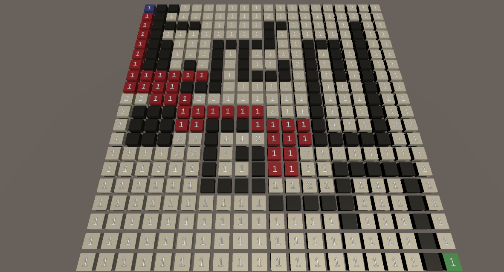
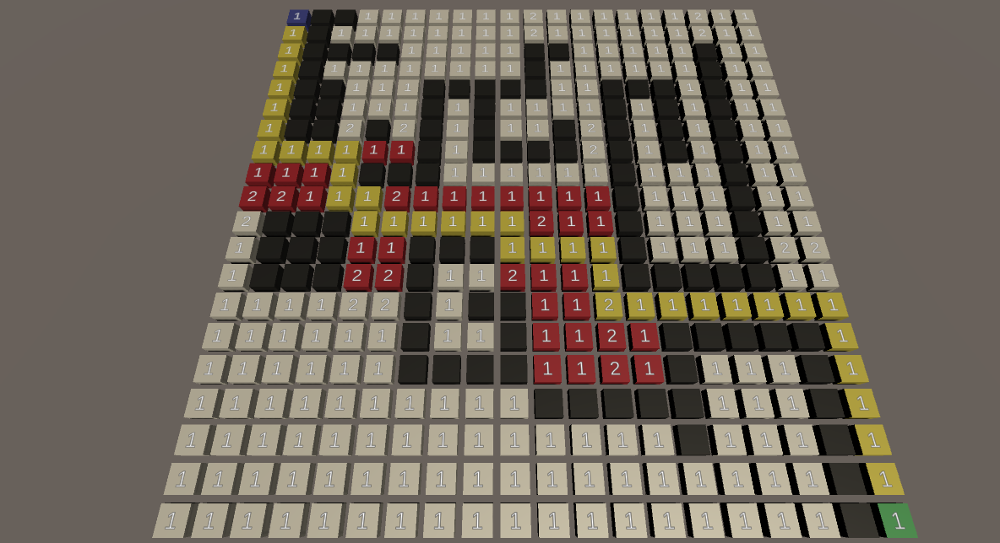
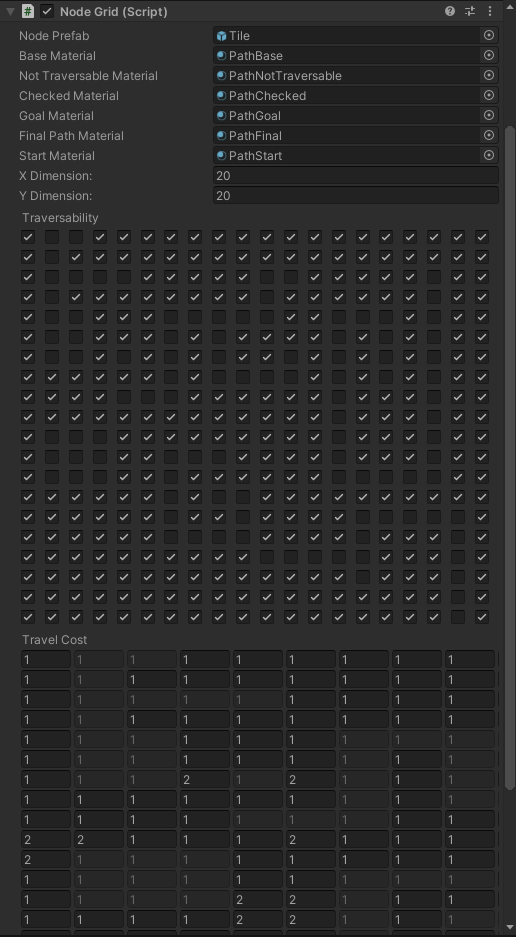

# Pathfinding
Project that includes algorithms for BFS, DFS, Dijkstra's, and A*

Keys to trigger pathfinding:
Q - Breadth first search
W - Depth first search
E - Dijkstra's Algorithm
R - A* pathfinding
T - Reset after a search finishes

Example of A* running:

Grid of tiles that are generated in runtime from an object with a NodeGrid Component.
All data for the nodes can be specified in the component (Whether they are traversable and how much it costs to traverse over them).

